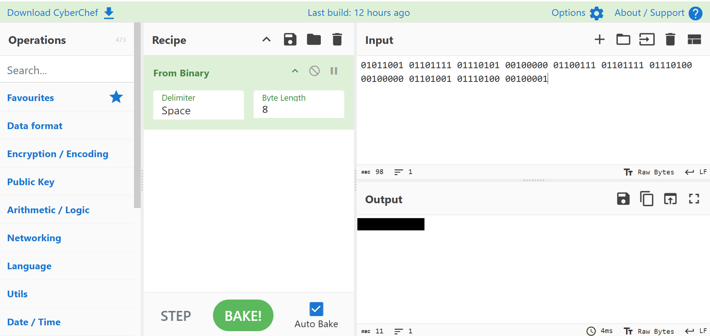
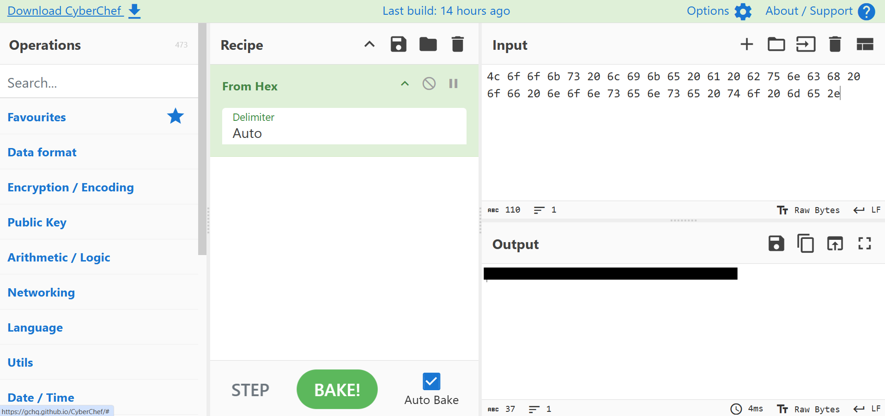
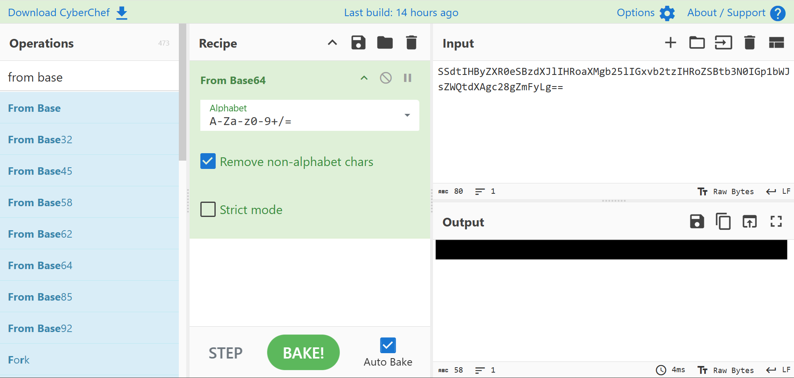
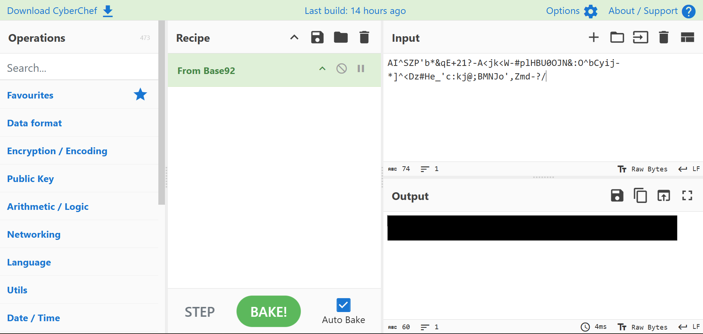

# TryCrackMe Level 1 Write-Up
Welcome! This is an official write-up for the CTF
[TryCrackMe Level 1](https://tryhackme.com/room/trycrackmelevel1), made by the room's creator 
[CyberFalcon101](https://tryhackme.com/p/CyberFalcon101).  

Note that although the steps to find the answers are given, the actual solutions are not provided.

## Task 1 - Encodings
Note: For this task I will be using [CyberChef](https://gchq.github.io/CyberChef/). Check [this room](https://tryhackme.com/room/cyberchefbasics) out if you don't know how to use CyberChef.

### ❓Question 1:

01011001 01101111 01110101 00100000 01100111 01101111 01110100 00100000 01101001 01110100 00100001

### 💡 Hint: Binary 

Using the `From Binary` operation, we get:



### ❓Question 2:

4c 6f 6f 6b 73 20 6c 69 6b 65 20 61 20 62 75 6e 63 68 20 6f 66 20 6e 6f 6e 73 65 6e 73 65 20 74 6f 20 6d 65 2e

### 💡 Hint: Hexadecimal 

Using the `From Hex` operation, we get:



### ❓Question 3:

SSdtIHByZXR0eSBzdXJlIHRoaXMgb25lIGxvb2tzIHRoZSBtb3N0IGp1bWJsZWQtdXAgc28gZmFyLg==

### 💡 Hint: Base64

Using the `From Base64` operation, we get:



### ❓Question 4:

AI^SZP'b*&qE+21?-A<jk<W-#plHBU0OJN&:O^bCyij-*]^<Dz#He_'c:kj@;BMNJo',Zmd-?/

### 💡 Hint: Base92

Using the `From Base92` operation, we get:



### Task 1 is successfully complete!

## Task 2 - Ciphers
Stuff
## Task 3 - Hashes
sth
## If you found this useful, go follow me on [TryHackMe](https://tryhackme.com/p/CyberFalcon101) and [Github](https://github.com/CyberFalcon101)


Do put this in grey box `Just do this`
```
OR THISSSSSSSSSSSSSSSSS
```

